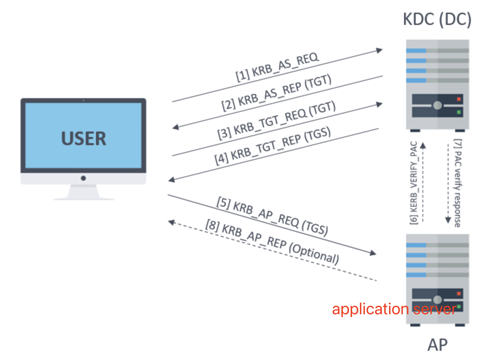
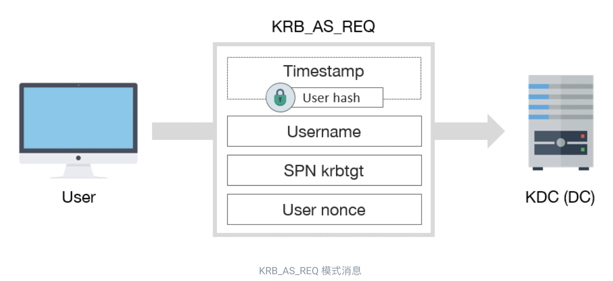
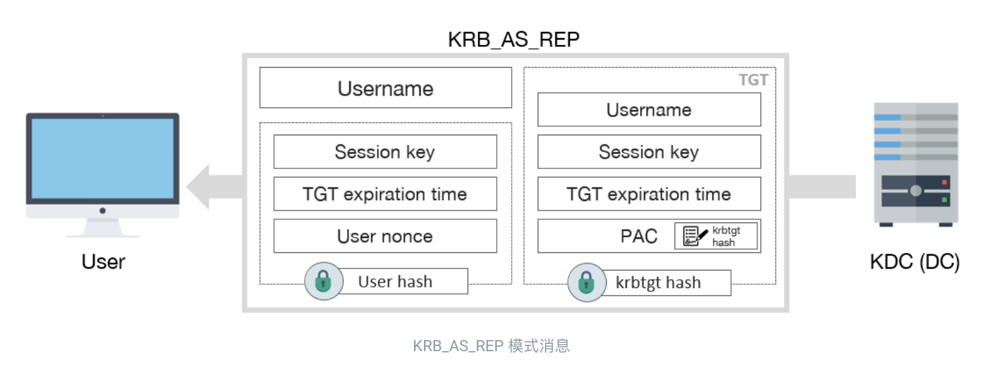
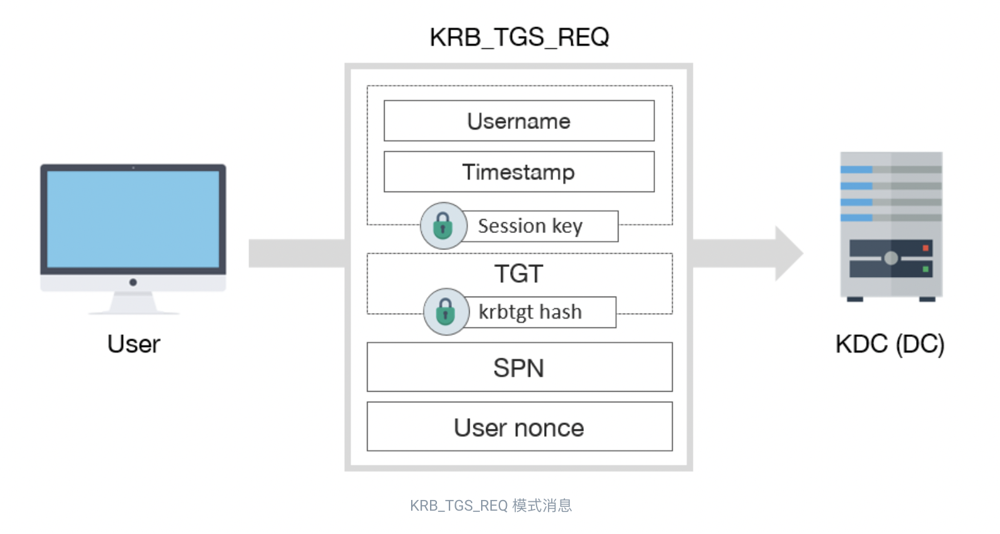
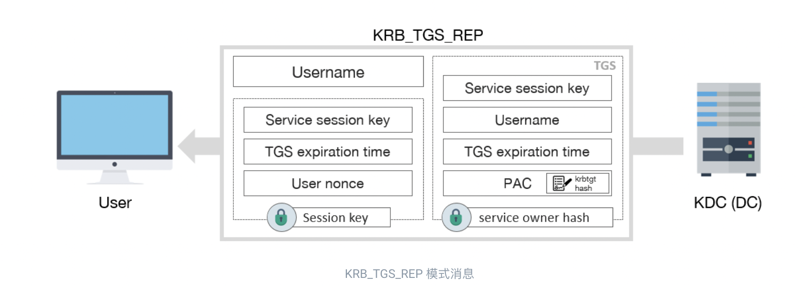
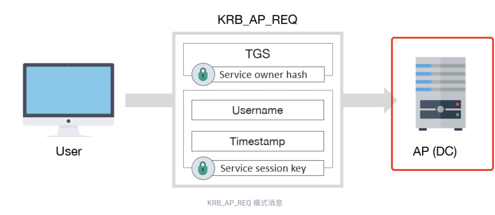

# Kerberos

## 什么是Kerberos

首先，Kerberos 是一种身份验证协议，而不是授权。换句话说，它允许识别每个提供secret password的用户，但是，**它不验证该用户可以访问哪些资源或服务**。

**Kerberos** 使用的端口是 **UDP/88** 和 **TCP/88**，它们应该在 KDC 中监听。

**LDAP** 使用的端口是**389**

**AP** (Application Server) which offers the service required by the user.

**KDC** （Key Distribution Center），Kerberos 的主要服务，负责签发票据，安装在 DC（Domain Controller）上。它由发布 TGT 的**AS** （Authentication Service）提供支持。

**Kerberos 主要处理如下structures，如票据：**

* **KDC or krbtgt key** which is derivate from **krbtgt account NTLM hash**.

* **User key** which is derivate from **user NTLM hash**.

* **Service key** which is derivate from **the NTLM hash of service owner**, **which can be a user or computer account.**

* **Session key** which is negotiated **between the user and KDC**.

* **Service session key** to be use **between user and service**.

**Kerberos 处理的主要结构是票据：**

* **TGT** (Ticket Granting Ticket) 是提交给 KDC 用来请求 TGS的票证。它使用 **KDC or krbtgt key** 加密
* **TGS** (Ticket Granting Service) 是用户可以用来对服务进行身份验证的票证，使用 **service key **加密

## 认证过程

### KRB_AS_REQ

首先，用户必须从 KDC 获得一个 TGT。为此，必须发送 KRB_AS_REQ：

*KRB_AS_REQ*具有以下字段：

- 带有客户端密钥的加密**时间戳**，用于验证用户身份并防止重放攻击
- 认证用户的用户名
- 与 krbtgt帐户关联的服务**SPN**
- 用户生成的**Nonce**

###  KRB_AS_REP

KDC 收到请求后，通过解密时间戳来验证用户身份。如果消息是正确的，那么它必须以*KRB_AS_REP响应*：

*KRB_AS_REP*包括以下信息：

1. 用户名

2. **TGT** （krbtgt hash 加密），其中包括：

   - 用户名

   - **Session key**

   - TGT的过期时间

   - **具有用户权限的PAC** ，由 KDC 签名

3. 使用用户hash加密的数据，其中包括：

   - **Session key**

   - TGT的过期时间

   - 用户随机数，防止重放攻击

完成后，用户已经拥有 TGT，可用于请求 TGS，然后访问服务。

### KRB_TGS_REQ

为了请求 TGS，必须向 KDC 发送*KRB_TGS_REQ消息：*

*KRB_TGS_REQ*包括：

- 使用 **session key** 加密的数据：
  - 用户名
  - 时间戳
- **TGT**
- <u>请求服务的**SPN**</u>
- 用户生成的Nonce

### KRB_TGS_REP

收到*KRB_TGS_REQ*消息后，KDC 在 KRB_TGS_REP 中返回一个*TGS* ：

*KRB_TGS_REP*包括：

- **用户名**
- **TGS** （service owner 的 hash 加密） ，其中包含：
  - **service session key**
  - 用户名
  - TGS的过期时间
  - **具有用户权限的PAC** ，由 KDC 签名
- 使用**session key**加密的数据：
  - **service session key**
  - TGS的过期时间
  - 用户随机数，防止重放攻击

### KRB_AP_REQ

最后，如果一切顺利，用户已经有一个有效的 TGS 可以与服务交互。为了使用它，用户必须向 AP 发送一个*KRB_AP_REQ*消息：

*KRB_AP_REQ*包括：

- **TGS**
- 使用**service session key**加密的数据：
  - 用户名
  - 时间戳，避免重放攻击

**References**

https://book.hacktricks.xyz/windows-hardening/active-directory-methodology/kerberos-authentication

# Tools

https://wadcoms.github.io/#

https://github.com/carlospolop/legion

# CheatSheet

### Pentesting-Network

https://book.hacktricks.xyz/generic-methodologies-and-resources/pentesting-network

### Pentesting-WEB

https://book.hacktricks.xyz/network-services-pentesting/pentesting-web

### Search Exploits

https://book.hacktricks.xyz/generic-methodologies-and-resources/search-exploits

### Brute Force

https://book.hacktricks.xyz/generic-methodologies-and-resources/brute-force

### psexec
https://docs.microsoft.com/en-us/sysinternals/downloads/psexec

**基本用法:** `psexec.exe \\192.168.10.131 -u administrator -p qwer1234 ipconfig`

psexec的基本原理是：通过管道在远程目标机器上创建一个psexec服务，并在本地磁盘中生成一个名为"PSEXESVC"的二进制文件。然后，通过psexec服务运行命令，运行结束后删除服务。

* psexec的使用不需要对方主机开机3389端口，只需要对方开启admin$共享或c$(该共享默认开启，依赖于445端口)。但是，假如目标主机开启了防火墙(因为防火墙默认禁止445端口的连接)，psexec也是不能使用的，会提示找不到网络路径。

* 如果是工作组环境，则必须使用administrator用户连接，使用普通用户连接会提示：登录失败: 未授予用户在此计算机上的请求登录类型。

* 使用本地用户登录域成员主机，也只能使用本地的 administrator 用户登录，前提是该主机没禁用administrator用户。

* 如果是域环境，连接普通域主机可以用普通域用户，连接域控需要域管理员，**域控不支持使用psexec本地用户登录**。

https://opensource-sec.com/2021/01/29/%E5%86%85%E7%BD%91%E6%B8%97%E9%80%8F%E4%B9%8BHash%E4%BC%A0%E9%80%92%E6%94%BB%E5%87%BB/

## 重要漏洞

### ms14-068

### zerologon CVE-2020-1472
https://cloud.tencent.com/developer/article/1837483?from=article.detail.1780108
mimikatz 还原可能失败，导致脱域

### CVE-2021-42287/CVE-2021-42278 

### CVE-2022-26923

### CVE-2021-34527（PrintNightmare）/Windows Print Spoole CVE-2021-1675

有安全研究员在github上公开了"CVE-2021-1675"的exp PrintNightmare，后经验证公开的exp是一个与CVE-2021-1675不同的漏洞，微软为其分配了新的编号CVE-2021-34527。

使用impacket包中的rpcdump.py 查看漏洞指纹，一般返回包含MS-RPRN或者MS-PAR则该主机可能存在漏洞

https://github.com/calebstewart/CVE-2021-1675

https://blog.csdn.net/weixin_42282189/article/details/122333229
http://blog.nsfocus.net/win-print-2021/

### samAccountName 欺骗 

###

## TODO

https://blog.ropnop.com/using-credentials-to-own-windows-boxes-part-2-psexec-and-services/

### brute SMB
`HYDRA_PROXY=socks5://xxxxx:8006 hydra -l Administrators  -p  root -s 445 127.0.0.1  smb -e n -f`